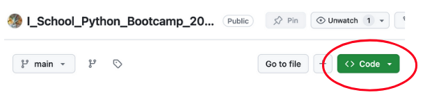
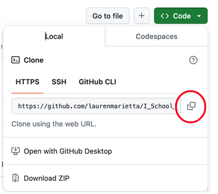

# Lab 1A - Installation
### July 29, 2024

## Overview
* Install Anaconda
* Install git
* Download course materials from GitHub
* Using Anaconda Navigator:
  * Create Python 3 environment with jupyter & notebook packages
  * Open the Jupyter notebook for Lab 1
* Complete the exercises laid out in the notebook

## 1 & 2. Install Anaconda & git

Follow the [instructions](../Day%200%20-%20Install/Setup%20Instructions.pdf) shared in the pre-Bootcamp email.

If you have problems, let the instructor know!

## 3. Download course materials from GitHub

#### Cloning the GitHub repository
1. Visit repository [homepage](https://github.com/laurenmarietta/I_School_Python_Bootcamp_2024/tree/main)
2. Click the green “code” dropdown

3. Click the “HTTPS” tab and copy the URL

4. In the terminal, navigate to your desired directory
5. Enter:
`git clone https://github.com/laurenmarietta/I_School_Python_Bootcamp_2024.git`

#### How to get repo updates
1. In the terminal, navigate into your repo directory
2. Check for updates: `git status`
3. Download updates: `git pull origin main`

## 4. Create environment & open Jupyter Notebook

1. Open Anaconda Navigator
2. Create a new environment named "bootcamp"
3. Install the `jupyter` and `notebook` packages in that environment
4. From the Home page in Navigator, launch Jupyter Notebook
5. Navigate to the director containing the class GitHub repo
6. Open the Lab 1A Jupyter notebook

## 5. Complete the exercises in the Lab 1A notebook 