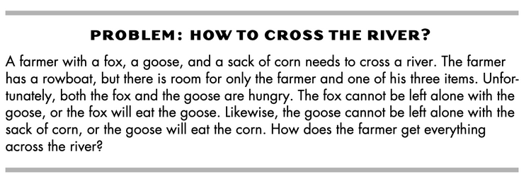
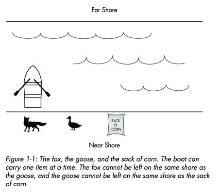

# Lab 1B - Computational Thinking
### July 29, 2024

## Overview
* Use the principles of computational thinking to solve a riddle
* Use the Scratch program to explore copmutational flow

## 1. Solve the Riddle

1. Using the principles of computational thinking, consider the following riddle:

2. Write out the constraints and potential operations of the riddle
3. Solve the riddle!
4. Write out the solution as an algorithm

## 2. Explore Scratch

1. Visit the online [Scratch editor](https://scratch.mit.edu/projects/editor/)
2. Create a short animation using all eight code block types (motion, looks, sounds, etc.)